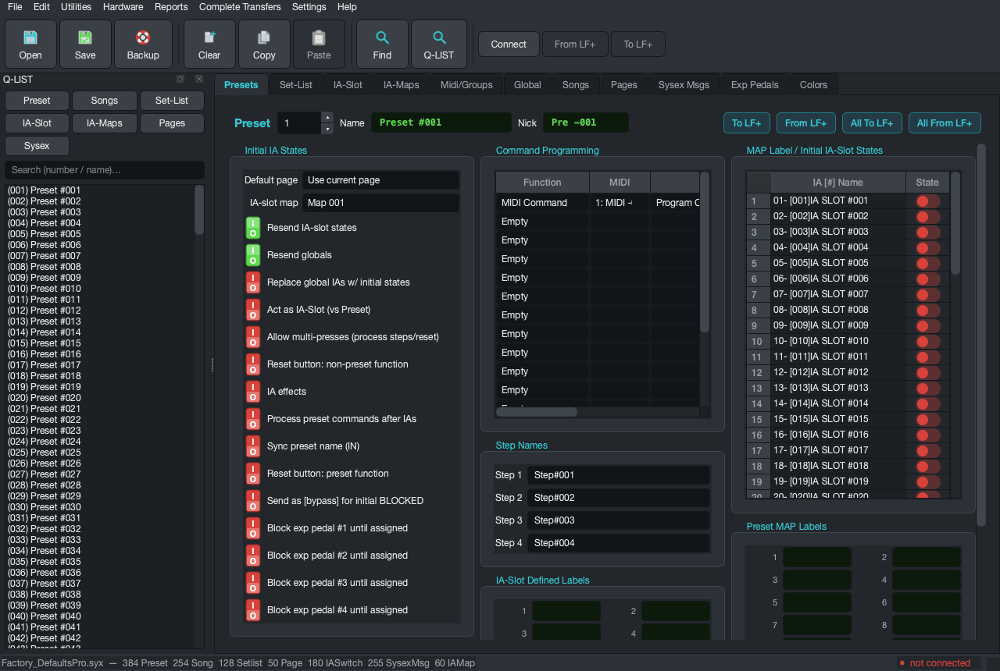
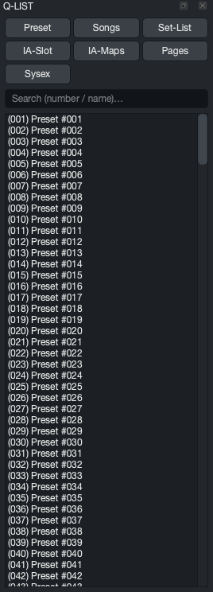
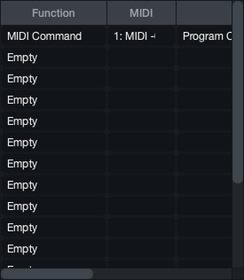
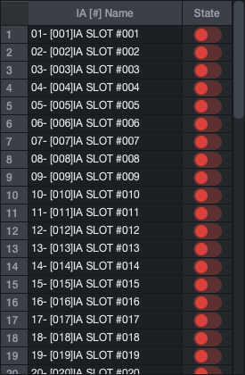
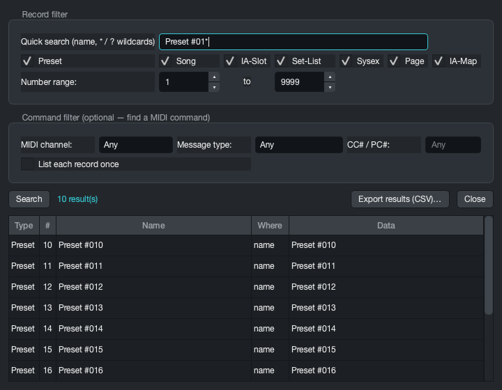
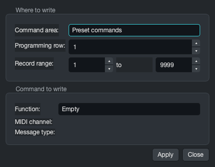
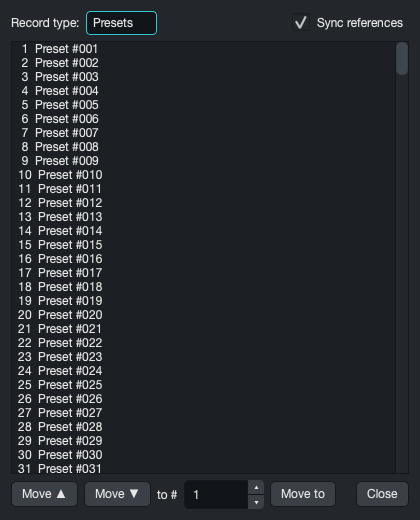
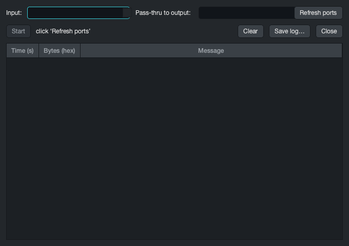
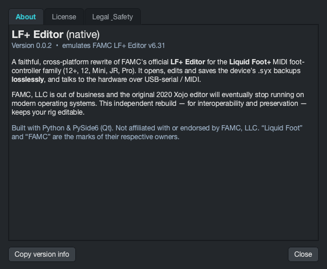

# LF+ Editor Desktop — User Guide

The desktop LF+ Editor is a native app for **macOS, Windows and Linux** that opens, edits and
saves Liquid Foot+ `.syx` backups **losslessly**, and talks to the hardware over USB. All three
OS builds are the same application built from one codebase — this guide applies to all of them
(screenshots taken from the macOS build with the bundled Pro+ factory program).

Compared to the editor this project replaces, the goal of this manual is simple: every control
explained, in the order you'll actually reach for it — quick start first, then a
reference for **every function**, then step-by-step **scenarios**.

> Prefer the browser? The same editor also runs [on the web](WEB_GUIDE.md) with no install.

---

## 1. Quick start

1. **Install** — see the [download / install notes](../USER_GUIDE.md#install--run-standalone-download--no-python)
   for your OS (unsigned-app first-launch steps included). Or run from source:
   `python -m lfeditor`.
2. **Load something**: **File → Open…** for one of your `.syx` backups, or
   **File → Load Factory Defaults into Editor ▸** to start from the factory program for your
   model (Mini / JR+ / 12+ / Pro+; Axe-Fx and Kemper programs are under *Load Special Factory
   Programming*). Factory loads open as **untitled**, so you can never overwrite the bundled
   originals.
3. **Edit.** Pick records with the **Q-LIST** dock on the left (filter, click), or the number
   spinner in each tab's header. Every edit is byte-surgical: saving rewrites only what you
   changed, everything else round-trips exactly.
4. **Save** (over the opened file) or **Backup** (save-as). The title bar shows a `•` while you
   have unsaved changes, and the app asks before replacing an unsaved document.

**Hover anything.** Every control carries the original editor's help text as its tooltip —
when a parameter name is opaque, hold the pointer over it.

---

## 2. Every function, top to bottom

### The toolbar

| Button | Function |
|---|---|
| **Open** | open a `.syx` backup |
| **Save** | save over the opened file |
| **Backup** | save-as a new `.syx` |
| **Clear** | reset the current record to factory blank (name "Preset #NNN", empty commands, states off) — confirmed first |
| **Copy** | snapshot the **whole current record** — including its linked label records — into an internal buffer (`Cmd/Ctrl+Shift+C`) |
| **Paste** | overwrite the current record's *content* with the buffer; the slot number stays; same record type only (`Cmd/Ctrl+Shift+V`) |
| **Find** | the Find / Q-LIST search window (`Cmd/Ctrl+F`) |
| **Q-LIST** | show/hide the record navigator dock |
| **Connect · From LF+ · To LF+** | device link over USB-serial (section 4) |

> Whole-record Copy/Paste never touches the OS clipboard — normal `Cmd/Ctrl+C/V` still works
> for text inside a field.

### The record header

Number spinner (type a number or step), **Name** (16 chars) and **Nick** (8 chars — what the
hardware LCD shows), and four transfer buttons: **To LF+ / From LF+** move *this* record,
**All To LF+ / All From LF+** run the complete transfers (same as the *Complete Transfers* menu).

### The Q-LIST dock

The record navigator. The **type buttons** jump to that record type's tab; the **search box**
filters by number or name; **click** an entry to show it. Entries are **draggable** — drop one
onto any slot picker (a Song's preset slot, a Set-List's song slot, an IA-Map cell) to assign
it, or drop an **IA-Slot** onto a command-table row to write an "IA ON Trig" command for it.

### The menus

| Menu | Items |
|---|---|
| **File** | Open… · Save · Backup (Save As)… · Load Factory Defaults into Editor ▸ (Mini / JR+ / 12/12+ / Pro+) · Load Special Factory Programming ▸ (Axe-Fx II Basic / Axe-Fx III Basic / Kemper / Kemper Performance) · Import from CSV ▸ / Export to CSV ▸ (Presets · Songs · Set-Lists · Sysex) · About / License |
| **Edit** | Copy · Paste · Find… · Clear Current Record… · Clear Preset Labels… · Clear Preset MAP Labels… · Clear Song Preset Labels… |
| **Utilities** | Quick Repeated Command Programmer… · Re-order Records (Save / Sync)… · MIDI Monitor / Pass-Thru… |
| **Hardware** | Device Connection Setup… (EEPROM wizard) · Connect / Disconnect · From LF+ (read all) · To LF+ (write edits) · *(Reset Config / Reset to Factory / Load Firmware are visible but disabled — device resets and firmware flashing are deliberately not enabled)* |
| **Reports** | Preset report… · Song report… · Set-List report… — human-readable CSV summaries with references resolved to names |
| **Complete Transfers** | Get Everything from LF+ · Send All Edits to LF+ |
| **Settings** | Show raw bytes · Q-LIST |
| **Help** | About / License |

The three **Clear … Labels** items blank a whole class of text-label records in the open
document (preset IA-slot labels / preset MAP labels / song button labels) after a confirm —
useful before rebuilding a rig's labelling from scratch.

### The 11 tabs

Each tab edits one record type (or the global configuration). Full-window shots of every tab:
[Presets](img/desktop/tab-presets.png) · [Set-List](img/desktop/tab-setlist.png) ·
[IA-Slot](img/desktop/tab-iaslot.png) · [IA-Maps](img/desktop/tab-iamaps.png) ·
[Midi/Groups](img/desktop/tab-midigroups.png) · [Global](img/desktop/tab-global.png) ·
[Songs](img/desktop/tab-songs.png) · [Pages](img/desktop/tab-pages.png) ·
[Sysex Msgs](img/desktop/tab-sysex.png) · [Exp Pedals](img/desktop/tab-exppedals.png) ·
[Colors](img/desktop/tab-colors.png)

| Tab | Edits |
|---|---|
| **Presets** | name/nick, default page, IA-slot map, behaviour toggles, the 16-row command table, step names, IA-Slot Defined Labels, initial IA states, Preset MAP Labels |
| **Set-List** | last-song / end-of-list behaviour, the 60-slot song list (name pickers) |
| **IA-Slot** | switch type, colours, group, sync device/effect, the On and Bypass command tables |
| **IA-Maps** | the 60-cell button → IA-slot mapping |
| **Midi/Groups** | the 16 channel device names, per-channel BANK +1/send/msb, Max Pre, Exclusive Groups, Grouped-IA order |
| **Global** | power-up, tap tempo, hardware IDs and timings, extender, LCD behaviour, combo blocking |
| **Songs** | the 24-slot preset list, LCD button labels, song commands, trigger + MTC |
| **Pages** | the graphical pedalboard, page groups, page parameters, per-button definition |
| **Sysex Msgs** | 16 data bytes with hex/dec read-outs, pre/post links, Auto-Create MMC |
| **Exp Pedals** | all four pedals end-to-end, plus **Live Calibrate…** when connected |
| **Colors** | every function- and preset-button colour |

### The raw byte view

**Settings → Show raw bytes** adds a live index/value table under every record tab. With the
data model fully mapped it's mostly confirmed-reserved bytes, but nothing is ever hidden — and
edits made anywhere show up here immediately.

---

## 3. Scenarios (offline editing)

### Rename a preset

Presets tab → pick the preset → type the **Name** (editor-facing, 16 chars) and **Nick** (the
hardware LCD text, 8 chars) → Tab out. Title bar shows `•` until you save.

### Program a preset's commands

The **Command Programming** table sends up to 16 commands when the preset fires:

1. **Function** → `MIDI Command` for a plain MIDI message. The **MIDI** column then picks the
   channel *by device name* (the names come from Midi/Groups), **Cmd** picks the message type,
   and **CC# / PC#** + **Data** carry the numbers.
2. For IA-work, pick an IA function (e.g. `IA ON Trig`) — the number column then holds the
   IA-slot number. Or skip the typing: **drag an IA-Slot from the Q-LIST onto the row**.
3. The read-out at the row's end decodes what will actually be sent — a quick sanity check.

### Set the preset's initial IA states

The **MAP Label / Initial IA-Slot States** table lists all 60 IA slots by name with an on/off
switch each — what state each IA takes when this preset loads. Combine with the *Resend
IA-slot states* toggle (hover it for the exact behaviour).

### Build a song, then a set-list

**Songs**: fill the 24 **Song Preset Definitions** slots (dropdowns list presets by name — or
drag from the Q-LIST), label buttons 1–12, add song-level commands, set the trigger type and
MTC if you run to timecode.
**Set-List**: fill the 60 song slots the same way. `Last Song Slot Used` and
`End of List Cycle Type` decide what Song-UP does at the end.

### Lay out a page

On **Pages**, the board shows 12 buttons at a time exactly as the hardware arranges them
(button 1 bottom-left). Click a tile to edit its two functions below — each is a **Type**
(`Empty / Preset / Function / IA Slot / Page Select`) plus a **Value** listed by name. **Drag a
tile onto another to swap the two buttons** (Shift-drag copies). The page-group navigator on
the right flips between button groups 1–12 / 13–24 / … / 49–60.

### Find anything — by name or by what it sends

**Find** (`Cmd/Ctrl+F`) searches every record: wildcard name search (`Lead*`), record-type
checkboxes, number range — and a **command filter** that finds records by their MIDI commands
(channel / message type / CC#-PC#), one row per matching command with the decoded data.
**Double-click a result** to jump to it. **Export results (CSV)…** saves the hit list. Results
are draggable onto slots, same as Q-LIST entries.

### Bulk edits

- **Right-click any toggle** → set it the same way for **all** records of that type or a
  number range — the fastest way to, say, flip one behaviour flag across 384 presets.
- **Utilities → Quick Repeated Command Programmer…** 
  writes one command into the same row across a range of records (presets / songs / IA-Slot
  ON / BYPASS). Tick the **PC# auto-increment** to write PC 0,1,2,… down the range — the
  classic one-preset-per-amp-patch setup in a single click.
- **Utilities → Re-order Records (Save / Sync)…** 
  moves a preset or song to a new slot. With **Sync references** ticked, every song slot and
  set-list slot that pointed at it is rewritten to follow, so nothing downstream breaks.

### Round-trip through a spreadsheet

**File → Export to CSV ▸** writes Presets / Songs / Set-Lists / Sysex in the exact column
format the original editor used (its old exports import here too). Edit in any spreadsheet,
**File → Import from CSV ▸** to apply — one changed row edits one record.
**Reports** are the read-only cousins: cross-referenced, name-resolved summaries for printing.

---

## 4. Scenarios (hardware)

> Everything here was verified against a real Liquid Foot+ — the protocol notes live in
> [LF_USB_DIRECT.md](LF_USB_DIRECT.md). Writes are always explicit and confirmed; keep a
> `.syx` backup anyway.

### First-time setup: make the device appear as a serial port

**Hardware → Device Connection Setup…** runs the connection wizard. The LF+ ships with a
custom USB identity that most systems have no driver for; the wizard rewrites the FTDI EEPROM
product-ID to the standard one so a serial port appears. It backs up the EEPROM first, and the
change is reversible on any OS (Revert flips the ID back to FAMC's `0x87C0`). One-time job per
device.

OS notes: **Windows** needs the FTDI VCP driver (usually already present); **Linux** users
must be in the `dialout` group; **macOS** works out of the box.

Prerequisites, what happens step by step, and issues to watch for (re-enumeration delay after a
write, EEPROM backup location, and more): **[EEPROM_SWITCH.md](EEPROM_SWITCH.md)**.

### Connect, pull, push

1. **Connect** — opens the port and puts the unit into *Editor Mode* (its LCD says so; the
   status dot goes green).
2. **From LF+** — reads every USB-exposed record type and overlays it onto the open document,
   including Songs / Set-Lists / Pages / IA-Slots (all bulk commands, hardware-confirmed
   2026-07-16), with a slower per-record pass (confirmed on hardware 2026-07-15) as an automatic
   fallback for any of those a device doesn't answer over bulk.
3. **To LF+** — writes **every record you've changed** since the last Open / From LF+, listed
   in a confirmation first. Each write is acknowledged by the device; per-record types
   (Songs/Set-Lists/IA-Slots) are additionally read back and compared before being called
   confirmed.
4. **Disconnect** — tells the unit to leave Editor Mode and closes the port cleanly. Avoid
   rapid reconnect cycles.

**Complete Transfers** menu = the same pull/push, phrased as "get everything / send all edits".

### Bidirectional MIDI over the editor cable (USB MIDI Bridge)

**Hardware ▸ USB MIDI Bridge…** recovers the original editor's bidirectional USB-MIDI mode.
Start validates the normal LF+ identification handshake, then sends `C9 → CA → CF`. The LF+
returns to its normal preset/control display, physical switches remain active, and the still-open
serial link carries MIDI in both directions.

On macOS/Linux the bridge creates one virtual input/output endpoint pair named **"LF+ IN PORT / LF+ OUT PORT"**.
Select that device as both a MIDI destination and source in the DAW. python-rtmidi cannot create
native virtual endpoints on Windows, so create and select **two distinct** loopback ports there
(one for each direction) using a driver such as **loopMIDI** (free); using one port for both can
create a feedback loop. Name the two ports **"LF+ IN PORT"** and **"LF+ OUT PORT"** to match the
macOS convention and the editor will select them automatically. **Hardware ▸ USB MIDI Bridge
Setup…** runs a live checklist (device detected, MIDI endpoints ready, device global "Allow MIDI
in") and walks through this Windows setup step by step.

* **DAW → LF+:** Program Changes and Control Changes retain the hardware-proven route, allowing
  preset selection and the manual's CC trigger set. The device global **"Allow MIDI in" must be
  YES**, and the DAW must use the LF+'s global MIDI channel. MIDI Clock, Start, Continue, and Stop
  are also forwarded for validation against the controller's DIN-clock behaviour. Active Sensing,
  System Reset, computer-originated SysEx, and unverified channel messages are filtered.
* **LF+ → DAW:** complete channel messages from the LF+ are republished exactly, including Notes,
  Poly/Channel Pressure, CC, Program Change, and Pitch Bend. Fragmented messages and running
  status are reconstructed. Clock, Start, Continue, Stop, and Active Sensing are forwarded without
  disturbing running status; System Reset is filtered. Valid 7-bit SysEx is forwarded unless it
  matches a known FAMC editor/control, reply, or ACK shape. FAMC-looking and malformed frames stay
  blocked because they cannot be distinguished safely from protocol traffic.

Editor Mode record transfers and the live bridge are mutually exclusive: starting the bridge
offers to disconnect the editor session, and clicking **Connect** stops the bridge by sending
`CC` before closing the serial port. Stop is safe to repeat and leaves the bridge restartable.

On the **Global** page, the Hardware MIDI Channel and **Expander via MIDI CHAN** controls display
channels **1–16**. The device data remains firmware-compatible and stores those values as 0–15.

### Calibrate expression pedals live

With the device connected, **Exp Pedals → Live Calibrate…** streams each pedal's position in
real time. Sweep each pedal you care about fully heel→toe (the bar records the range), then
**Save Calibration** — only swept pedals are written. Known device quirk: right after a
calibration save the unit may ignore software disconnect; press its physical **[sel]** button
to leave Editor Mode. (The original editor behaves the same way.)

### Watch the MIDI stream

**Utilities → MIDI Monitor / Pass-Thru…** logs every message on any MIDI input the OS exposes
(timestamp, raw hex, decoded text), optionally relaying to an output port so the editor can sit
between a controller and your DAW. The log saves to CSV. It's a general-purpose MIDI tool — it
works with any ports, not just the LF+.

---

## 5. Housekeeping

- **About / License** (File or Help menu) — version, the MIT license, and the legal & safety
  notes.
- **Nothing phones home.** The app has no network features at all; device I/O is the USB cable.
- **Unsaved changes** are marked with `•` in the title and guarded by a confirm on
  load-over/quit.
- **Troubleshooting**: no serial port → run the Device Connection Setup wizard (and check the
  OS notes above); From/To buttons greyed → you're not connected; device wedged after an
  interrupted session → press its [sel] button, wait a few seconds, reconnect.

**More:** [USER_GUIDE.md](../USER_GUIDE.md) (install + reference) ·
[WEB_GUIDE.md](WEB_GUIDE.md) (the browser version) · [BUILD.md](BUILD.md) (building bundles) ·
[UAT.md](UAT.md) (the acceptance-test run) · [LF_DATA_MODEL.md](LF_DATA_MODEL.md) /
[LF_PROTOCOL.md](LF_PROTOCOL.md) (byte-level documentation).

*Screenshots show the bundled Liquid Foot+ Pro+ factory program, rendered by the app itself —
`scripts/desktop_screenshots.py` regenerates them.*
