# LF+ Editor Web — User Guide

The web editor is the full LF+ Editor running **entirely in your browser** — nothing to install,
nothing uploaded. It opens the same `.syx` backups the hardware and the desktop app use, edits them
**losslessly** (untouched bytes round-trip exactly), and downloads the result. It is a 1:1 clone of
the desktop build: the same 11 tabs, the same controls, the same tools, and the original LF+
Editor's hover help on every field.

> **Your data never leaves your machine.** The editor is a static page; the `.syx` file is decoded
> and re-encoded locally in your browser. There is no server and no account.

**Browser support:** any modern browser for editing. **Chrome or Edge** if you also want the
USB device connection — Firefox and Safari don't implement WebSerial, so the Connect button is
disabled there. Windows: the device needs the FTDI VCP driver —
[install steps](GETTING_STARTED.md#3-windows-install-the-ftdi-vcp-driver-first).

---

## 1. Getting started in five minutes

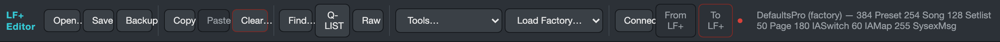

1. **Open the editor.** On first load it fetches the Python runtime (a few MB, cached afterwards)
   and then shows *"ready — open a .syx or load a factory default"*.
2. **Load your rig** with **Open…** (pick a `.syx` backup you exported from the LF+ Editor or from
   this app), or start from **Load Factory…** — the same bundled factory programs the original
   ships: Mini / JR+ / 12 (12+) / Pro+, plus the Axe-Fx and Kemper special programs.
   The status bar (top right) confirms what's loaded: `384 Preset  254 Song  128 Setlist …`.
3. **Edit.** Click through the tabs, change what you need. The moment anything changes, an amber
   **● unsaved** badge appears in the toolbar.
4. **Save your work.** **Save** and **Backup** both download a fresh `.syx` (a browser can't
   overwrite the file you opened — treat Save as "download current state" and keep your originals).
   Loading a factory program marks the document *untitled* so you can't mistake it for your rig.

That's the whole loop: open → edit → download. Everything else in this guide is detail.

### The toolbar, left to right

| Button | What it does |
|---|---|
| **Open… / Save / Backup** | load a `.syx` · download the current state · download a copy |
| **Copy / Paste / Clear…** | whole-**record** operations on the record you're viewing (see [scenario 12](#12-copy-a-whole-preset-onto-another-slot)) |
| **Find…** | the Find / Q-LIST search dialog ([scenario 10](#10-find-anything--by-name-or-by-midi-command)) |
| **Q-LIST** | toggle the left-hand record navigator dock |
| **Raw** | toggle the raw byte view for the current record |
| **Tools…** | CSV import/export, reports, Quick Command Programmer, Re-order Records, Clear labels |
| **Load Factory…** | load a bundled factory program |
| **Connect / From LF+ / To LF+** | USB device I/O — Chrome/Edge only ([scenario 15](#15-talk-to-the-hardware-over-usb)) |

### The record header

Every record tab has the same header: the record **number spinner** (type a number or step it),
the **Name** (16 characters) and **Nick** (8 characters — what the hardware's LCD shows) fields in
green LCD style, and the four **transfer buttons** for device I/O. The Q-LIST dock and the Find
dialog are usually faster than the spinner for getting around — see below.

### Hover help — the original's tooltips

Hold the pointer over almost any control — a toggle, a dropdown, a section title — and the
**original LF+ Editor's own explanation** appears. This is FAMC's help text, recovered from the
original app and mapped 1:1, so when a parameter name is cryptic ("Act as IA-Slot (vs Preset)"),
the answer is one hover away.

---

## 2. What each tab edits

| Tab | Edits |
|---|---|
| **Presets** | name/nick, default page, IA-slot map, behaviour toggles, the 16-row **Command Programming** table, step names, IA-Slot Defined Labels, **MAP Label / Initial IA-Slot States**, Preset MAP Labels |
| **Set-List** | last-song / end-of-list behaviour and the 60-slot **song list** (name pickers) |
| **IA-Slot** | switch type, colours, group, sync device/effect, and the **On** and **Bypass** command tables |
| **IA-Maps** | the 60-cell button → IA-slot mapping (name pickers) |
| **Midi/Groups** | 16 MIDI-channel device names, per-channel BANK +1/send/msb switches, Max Pre, Exclusive Groups, Grouped-IA order |
| **Global** | power-up behaviour, tap tempo, hardware settings (Sysex ID, MIDI channel…), extender, LCD behaviour, combo blocking |
| **Songs** | the 24-slot **preset list**, LCD button labels, song command table, trigger type + MTC |
| **Pages** | the graphical 12-button pedalboard, page groups, page parameters, per-button definition |
| **Sysex Msgs** | 16 data bytes (hex + decimal read-outs), pre/post links, Auto-Create MMC |
| **Exp Pedals** | all four pedals: type, CC#, channel, sweep, triggers, sensitivity |
| **Colors** | every function-button and preset-button colour |

---

## 3. Scenarios

The rest of this guide is task-by-task. Each scenario assumes you have a file loaded.

### 1. Rename a preset (and give it an LCD nickname)

1. Go to **Presets** and pick the preset (spinner, Q-LIST, or Find).
2. Type the full name in **Name** (up to 16 characters) — this is the editor-facing name.
3. Type the **Nick** (up to 8) — this is what the hardware's button LCD shows.
4. Press Tab or click away; the **● unsaved** badge confirms the edit took.

The same header works on Songs, Set-Lists, IA-Slots, Pages, Sysex Msgs and IA-Maps.

### 2. Program a preset's MIDI commands

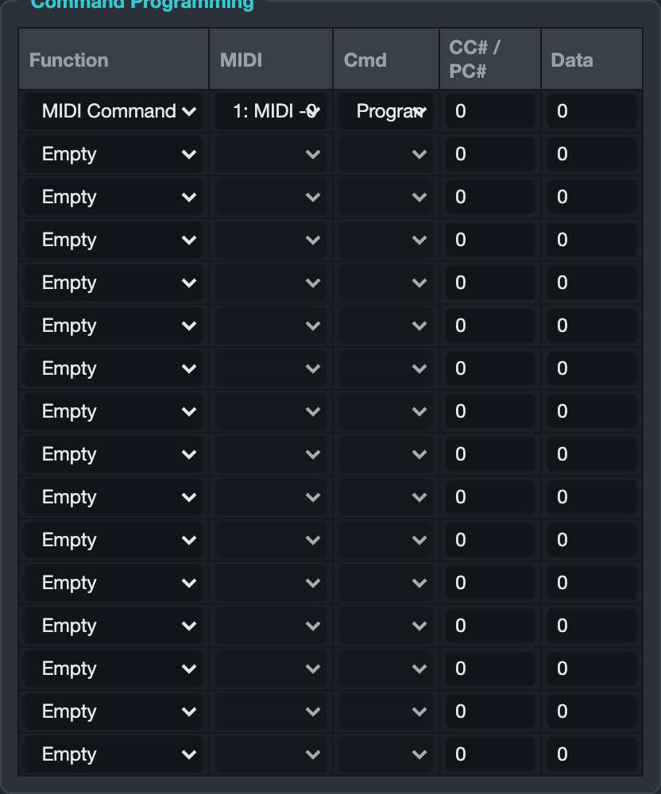

The **Command Programming** table is the heart of a preset — up to 16 commands sent when the
preset is triggered. Columns mirror the original: `Function | MIDI | Cmd | CC#/PC# | Data`.

To send **Program Change 5 on your amp's channel** from row 1:

1. **Function** → `MIDI Command`. (The MIDI and Cmd columns light up only for MIDI commands.)
2. **MIDI** → pick the channel *by device name* — the names come straight from your
   Midi/Groups tab, so it reads "2: Kemper", not just "2".
3. **Cmd** → `Program Change`.
4. **CC# / PC#** → `5`.

For a **Control Change**, pick `Control Change`, set CC# and put the value in **Data**.
For **IA triggers** (`IA ON Trig`, `IA Bypass Trig`, …) the CC#/PC# column holds the IA-slot
number instead — or skip the typing entirely: **drag an IA-Slot out of the Q-LIST dock onto a
row** and the editor writes an "IA ON Trig" command for that slot into it.

### 3. Set a preset's initial IA states

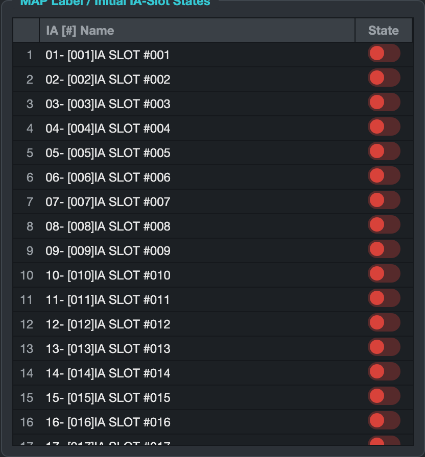

The **MAP Label / Initial IA-Slot States** table lists all 60 IA slots by name with a red/green
**State** switch each — exactly the original's table. Click a switch to set whether that IA comes
up ON (green) or OFF (red) when the preset loads. Pair it with the **Resend IA-slot states**
toggle in *Initial IA States* (hover it — the original's help text explains the exact behaviour).

Want the same flag set across many presets? See [scenario 11](#11-bulk-edits--the-three-power-tools).

### 4. Configure an IA-Slot

On the **IA-Slot** tab:

1. **Switch type** (Stomp, etc.) and the four **colours** (On / Off / Bypass / Blocked) define how
   the slot looks and behaves on a button.
2. **Group ID** puts the slot into an exclusive group — one ON at a time, the rest go BYPASS
   (group behaviour is tuned on **Midi/Groups**).
3. The **On Command Programming** and **BYPASS (OFF) Command Programming** tables are two
   command tables side by side — same editing as scenario 2: what to send when the IA turns on,
   and what to send when it bypasses.
4. **Sync device / Sync effect** link the slot to an Axe-Fx or Kemper effect for real-time sync.

### 5. Build a song

On the **Songs** tab:

1. Fill the **Song Preset Definitions** — 24 slots, each a dropdown listing every preset **by
   name**. (Or drag presets from the Q-LIST straight onto slots.)
2. Give buttons 1–12 their **LCD Button Labels**.
3. Add song-level commands in **Command Programming** (sent when the song loads).
4. In **Parameters**, set the trigger type, and enable **MTC** with Hour/Min/Sec/Frame if you
   drive the song from timecode.

### 6. Arrange a set-list

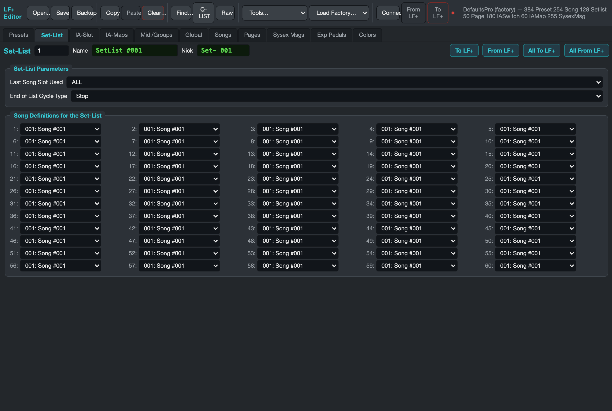

On the **Set-List** tab, the **Song Definitions** grid is 60 slots of song pickers. Fastest fill:
click **Q-LIST**, switch its type dropdown to **Songs**, then **drag songs onto slots** — the slot
updates and the file is marked dirty. `Last Song Slot Used` and `End of List Cycle Type` control
what Song-UP does at the end of the list (hover them for the original's explanation).

### 7. Lay out a page (the pedalboard)

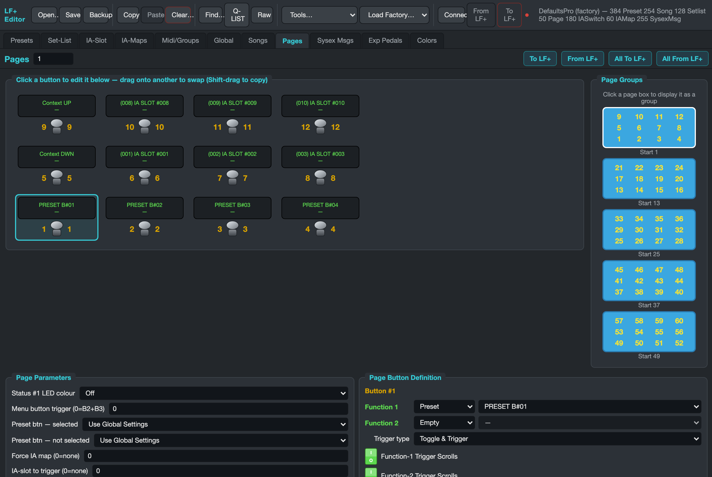

The **Pages** tab is the graphical pedalboard editor:

- The board shows **12 buttons at a time**, laid out like the hardware (button 1 bottom-left,
  numbers rise upward). Each tile shows its two assigned function names.
- The blue **Page Groups** navigator (right) switches which 12-button group you're viewing —
  "Start 1 / 13 / 25 / 37 / 49".
- **Click a tile** to edit it in **Page Button Definition** below: Function 1 and Function 2 are
  each a **Type** (`Empty / Preset / Function / IA Slot / Page Select`) plus a **Value** picker
  listing that type's items by name. Set the **Trigger type** and the four behaviour toggles
  (Trigger-Scrolls, Double-Tap, Wait-for-Release).
- **Drag one tile onto another to swap** the two buttons completely (functions + flags).
  **Shift-drag copies** instead of swapping.
- **Page Parameters** (bottom left) holds the page-wide settings: Status-LED colour, menu-button
  trigger, preset-button colours, forced IA map, and all-buttons-double-tap.

### 8. Remap an IA-Map

The **IA-Maps** tab is one grid: 60 button cells, each a dropdown that picks the IA-slot **by
name**. Change a cell, done. Q-LIST drag works here too (type: IA-Slot).

### 9. Craft a sysex message

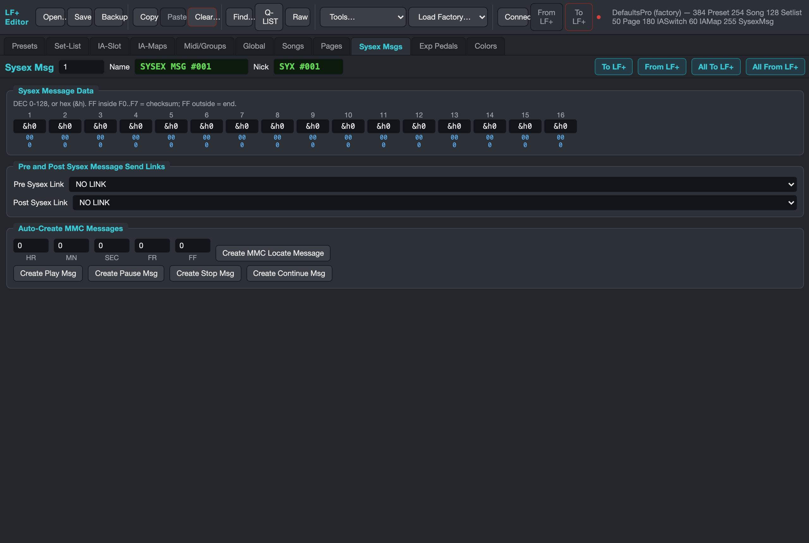

On **Sysex Msgs**, each record is 16 bytes shown as `&h` hex cells with blue **hex + decimal
read-outs** underneath. Rules from the original apply (`FF` inside `F0…F7` = checksum; `FF`
outside = end). **Pre / Post Sysex Link** chains another message before/after this one.
The **Auto-Create MMC Messages** panel writes a complete MIDI Machine Control message for you:
set HR/MN/SEC/FR/FF and click **Create MMC Locate Message**, or use the one-click
Play / Pause / Stop / Continue buttons.

### 10. Find anything — by name or by MIDI command

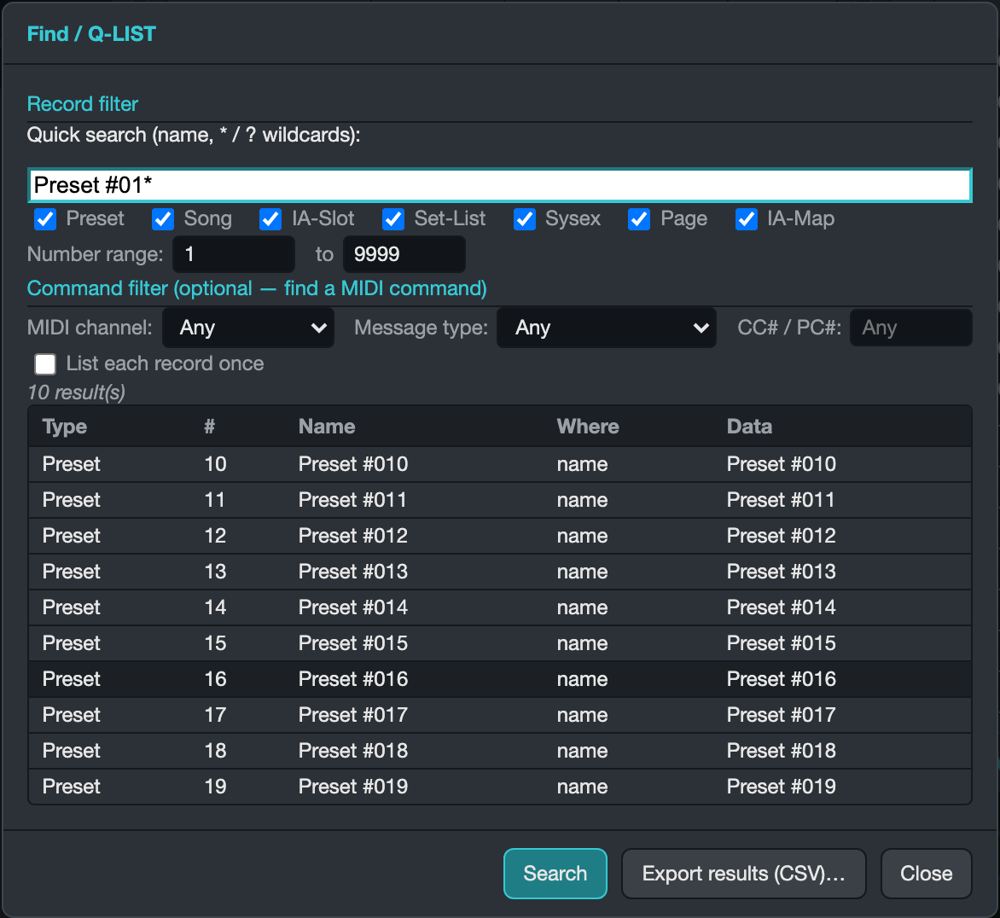

**Find…** opens the original's *Find / Q-LIST* window:

- **Quick search** takes a name or a wildcard (`*` / `?`): `Lead*` finds every record whose name
  starts with "Lead". Restrict by **record type** (the seven checkboxes) and **number range**.
- The **Command filter** finds records *by what they send*: e.g. Message type `Program Change` +
  MIDI channel 2 lists every record with a PC on channel 2 — one row per matching command, with
  the decoded command in the **Data** column. **List each record once** collapses duplicates.
- **Click a result row** to jump straight to that record. **Export results (CSV)…** downloads the
  hit list.

For everyday navigation the **Q-LIST dock** is quicker: toggle it on, filter by number or name,
click to jump — and drag items onto slots.

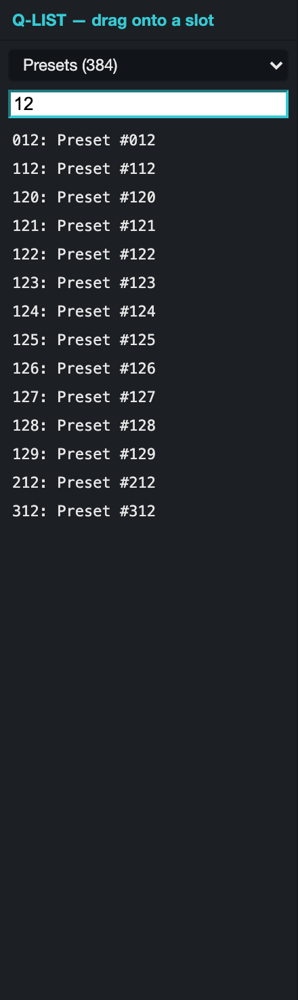

### 11. Bulk edits — the three power tools

**a) Right-click multi-apply.** Right-click any toggle on a record tab (e.g. "Resend IA-slot
states" on Presets) → *Apply toggle to many records* → give it a From/To range → **Apply**. The
toggle's current state is written across the whole range in one go.

**b) Quick Repeated Command Programmer** (Tools… menu).

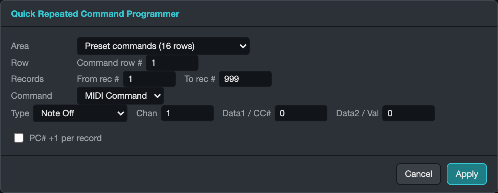

Writes **one command into the same row across a range of records** — presets, songs, or IA-Slot
ON/BYPASS tables. Example, the classic "PC per preset" setup: Area `Preset commands`, Row `1`,
Records `1–60`, Command `MIDI Command / Program Change / channel of your amp`, tick
**auto-increment PC#** — presets 1–60 get PC 0,1,2,… in row 1.

**c) Re-order Records** (Tools… menu).

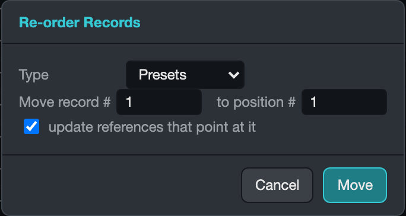

Moves a preset or song to a new position. Keep **update references** ticked: every song
preset-slot (or set-list song-slot) that pointed at the moved record is rewritten to follow it,
so your songs and set-lists don't silently break.

### 12. Copy a whole preset onto another slot

1. Show the source record, click **Copy** — the *entire* record (name, commands, states, linked
   label records) is snapshotted internally.
2. Navigate to the destination record (same type), click **Paste** — its content is replaced,
   its slot number stays.
3. **Clear…** resets the current record to factory blank (confirmed first).

### 13. Spreadsheet round-trips (CSV) and reports

**Tools… → Export CSV…** downloads Presets / Songs / Set-Lists / Sysex in **exactly the original
editor's column format** — old exports load too. Edit names and slot assignments in any
spreadsheet, then **Tools… → Import CSV…** to apply. Imports are surgical: one changed row
changes one record.

**Tools… → Preset / Song / Set-List report…** downloads a human-readable summary with
cross-references resolved to names (each song's presets by name, etc.) — great for a printed
rig sheet.

### 14. Peek at the raw bytes

**Raw** toggles a bottom panel showing every decoded byte of the current record
(index / decimal / hex), live. With the data model fully mapped you rarely need it, but nothing
is ever hidden — and it updates as you edit.

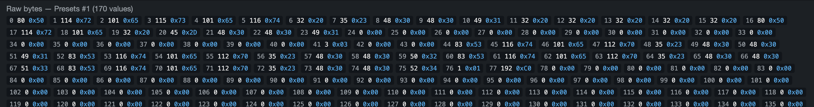

### 15. Talk to the hardware over USB

> **Requirements:** Chrome or Edge, on `https` or `localhost`. This path is **verified on real
> hardware** (a browser pull is byte-identical to a desktop-app pull, and writes ACK and read
> back correctly) — but writes have no undo, so always keep a `.syx` backup before writing.

1. **Connect** — pick the LF+'s serial port in the browser prompt. The dot turns green and the
   device LCD shows *Editor Mode*.
2. **From LF+** — reads every USB-exposed record type (Presets, Config, IA-Maps, Sysex, label
   records, and Songs/Set-Lists/IA-Switches via a slower per-record pass) into the editor.
   Non-destructive.
3. **To LF+** — writes the current record back, behind an explicit confirmation. The device
   acknowledges each write.
4. **Disconnect** (Connect again) leaves Editor Mode cleanly.

Songs, Set-Lists and IA-Slots transfer over USB via a slower per-record request (same on
desktop, confirmed on hardware 2026-07-15) — read-only for now. Pages are **not in the device's
USB read set by any known request** — edit those offline and load the saved `.syx` via the
original transfer path. Details — and the
**step-by-step first-hardware smoke test** to run when you first try this with a real LF+ —
in [WEBSERIAL.md](WEBSERIAL.md).

---

## 4. Safety, limits and troubleshooting

- **Nothing is uploaded.** The editor runs client-side; your rig stays on your machine.
- **Save = download.** The browser can't overwrite the opened file. Keep your original `.syx`
  files; the amber **● unsaved** badge tells you when there are changes you haven't downloaded.
- **Losslessness.** Only the bytes you change are rewritten; a load→save with no edits reproduces
  your file byte-for-byte (this is covered by automated tests on every change).
- **First load is slow, later loads aren't.** The Python runtime (~a few MB) is fetched once and
  cached.
- **The Connect button is greyed out** → you're in Firefox/Safari (no WebSerial), or the page
  isn't on `https`/`localhost`.
- **Not in the web build (yet):** MIDI Monitor / Pass-Thru, the EEPROM connection wizard, live
  expression-pedal calibration, and device resets / firmware loading — use the
  [desktop app](../USER_GUIDE.md) for those.
- **Tab-by-tab reference shots:** every tab is pictured in [`docs/img/web/`](img/web/) —
  [Presets](img/web/tab-presets.png) · [Set-List](img/web/tab-setlist.png) ·
  [IA-Slot](img/web/tab-iaslot.png) · [IA-Maps](img/web/tab-iamaps.png) ·
  [Midi/Groups](img/web/tab-midigroups.png) · [Global](img/web/tab-global.png) ·
  [Songs](img/web/tab-songs.png) · [Pages](img/web/tab-pages.png) ·
  [Sysex Msgs](img/web/tab-sysex.png) · [Exp Pedals](img/web/tab-exppedals.png) ·
  [Colors](img/web/tab-colors.png)

**More:** [WEB.md](WEB.md) (how the web build works) · [WEBSERIAL.md](WEBSERIAL.md) (device
protocol over WebSerial) · [PARITY.md](PARITY.md) (desktop ↔ web parity audit) ·
[UAT.md](UAT.md) (the acceptance-test run) · [USER_GUIDE.md](../USER_GUIDE.md) (desktop guide).

*Screenshots show the bundled Liquid Foot+ Pro+ factory program and were captured from the app
itself (`scripts/web_screenshots.py` regenerates them).*
